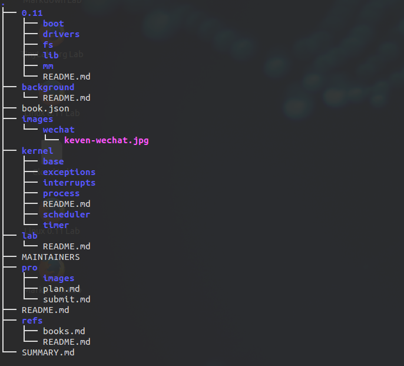

## lad-book 合入规范细则

### 章节目录划分

#### <font color=red>章节目录</font>



#### <font color=red>章节目录介绍</font>

<font color=red>

- 0.11 - 0.11 kernel 核心部分详解
	- boot - 启动引导详解
	- drivers - 设备驱动程序详解
	- fs - 文件系统详解
	- lib - 库文件、有文件详解
	- mm - 内存管理详解
- backgroud - Linux 背景详解
- images - 图片目录
	- _images -  本书章节图片
	- wechat - 本书贡献者微信 
- kernel - 0.11 kernel 部分详解
	- base - kernel 基础数据结构、C语言用法详解
	- exceptions - 异常部分详解
	- interrupts - 中断部分详解
	- process - 进程部分详解
	- scheduler - 调度器部分详解
	- timer - 时钟部分详解
- lab - 本书实验环境详解
- refs - 参考资料
- SYMMARY - 书目录
- MAINTAINERS - 贡献者名单
- pro - 项目相关细则
	- plan - 项目计划书
	- sumbit - 提交规范
	- images - 图片

</font>

### 章节命名

年-月-日-主题内容.md 

**示例**

异常处理章节内容命令如下

2017-11-15-oldlinx-exception.md

### 图片命名

和章节命名保持一致，如一个章节中有多个图片则采用下标的形式。

**示例**

2017-11-15-oldlinux-exceptions-0.jpg

表示关于异常的第一篇文章

### 制图工具

**本地工具**

#### markdown 绘图

<font color=red>**LR Graph**</font>
	```
	graph LR
	A-->B;
	B-->C;
	B-->D
	B-->E
	```
	<font color=red>**TD Graph**</font>
	```
	graph TD
	A-->B;
	B-->C;
	B-->D
	B-->E
	```
	<font color=red>**Sequence Diagrm**</font>
	```
	sequenceDiagram
	participant Alice
	participant Bob
	Alice->John: Hello John, how are you?
	loop Healthcheck
	John->John: Fight against hypochondria
	end
	Note right of John: Rational thoughts <br/>prevail...
	John-->Alice: Great!
	John->Bob: How about you?
	Bob-->John: Jolly good!
	```


### 提交指南

[请点击演示链接]()


> Lad-book Team  
