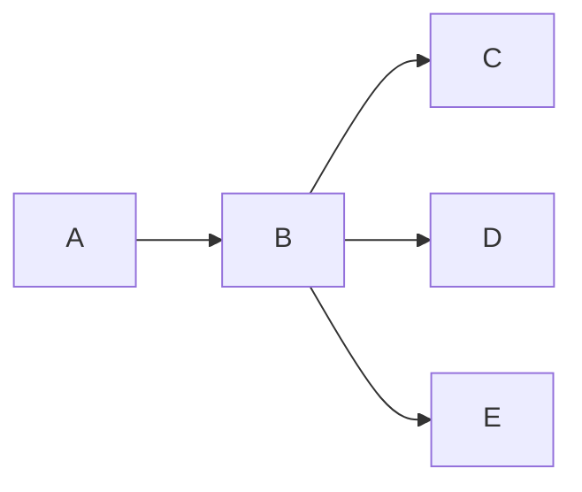
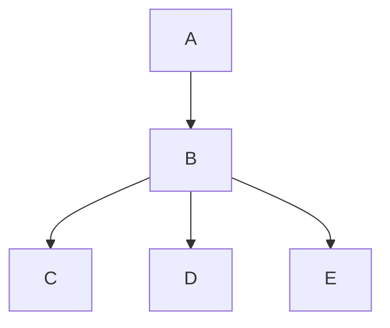
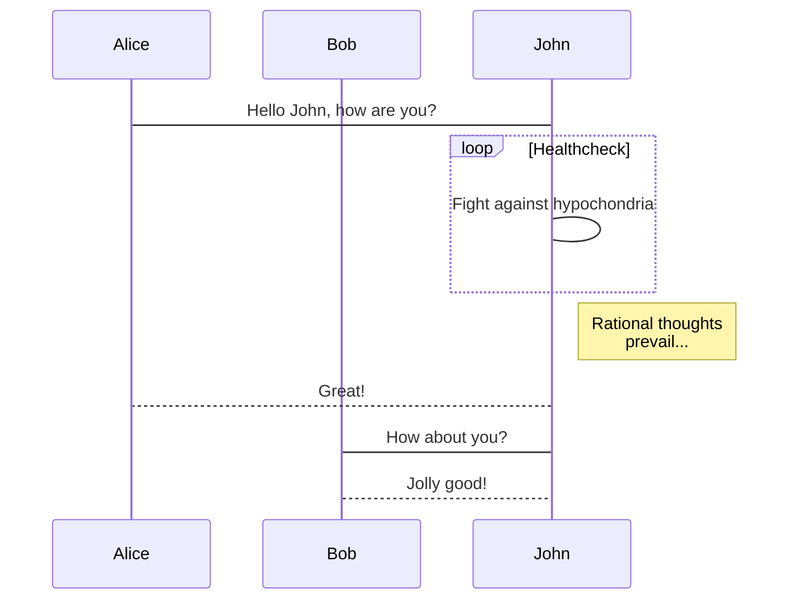

# Lad Book 提交规范

## 章节目录介绍

* README.md - 本书简介
    * SUMMARY.md - 书目录
    * MAINTAINERS.md - 贡献者名单
    * plan.md - 项目计划
    * sumbit.md - 提交规范

* background - Linux 背景详解
    * history.md - Linux 历史
    * principle.md - 微机原理
    * programming - 内核编程
        * assembly.md - 汇编语言
        * c.md - C 语言
        * exec.md - 目标文件格式
        * makefile.md - Makefile
    * isa - ISA
        * x86.md - X86
        * arm.md - ARM
        * mips.md - MIPS
        * powerpc.md - PowerPC
    * emulator - 模拟器
        * qemu.md - Qemu
        * bochs.md - Bochs

* lab - 本书实验环境详解

    * env - 搭建环境
        * linux.md - Linux
        * windows.md - Windows
        * macosx.md - Mac OSX
    * experiment - 实验过程
        * edit.md - 编辑
        * compile.md - 编译
        * run.md - 运行
        * debug.md - 调试
    * filesystem - 文件系统
        * image.md - 镜像制作
        * share.md - 文件传输
    * source - 源码分析
        * calltree.md - 调用关系
        * index.md - 代码检索

* kernel - 内核体系结构详解
    * model.md - 内核模式
    * arch.md  - 内核架构
    * core - 核心功能
        * interrupt.md - 中断机制
        * timer.md - 时钟管理
        * process.md - 进程管理
        * mm.md - 内存管理
        * filesystem.md - 文件系统
        * stack.md - 堆栈用法
        * syscall.md - 系统调用
    * app.md - 应用程序
    * source.md - 源码结构
    * config.md- 配置系统
    * compile.md - 编译系统

* 0.11 - 0.11 内核详解
    * build.md - 建构工具
    * boot.md - 引导启动程序
    * init.md - 初始化程序
    * kernel.md - 内核代码
    * math.md - 数学协处理器
    * mm.md - 内存管理
    * filesystem.md - 文件系统
    * drivers - 驱动程序
      * block.md - 块设备
      * char.md - 字符设备
    * header.md - 头文件
    * lib.md - 库文件

* refs - 参考资料
    * standards - 标准文件
        * a.out.md - a.out
        * elf.md - ELF
        * ascii.md - ASCII 码表
        * posix.md - POSIX
    * books.md - 经典书籍
    * links.md - 重要网址

* images - 图片目录
    * CHAPTER - 本书章节图片
    * wechat - 本书贡献者微信 

## 图片

### 上传图片

图片请根据上述目录结构统一存放在 `images/` 目录下，图片命名请以章节名为前缀，图片内容梗概为后缀，尽量言简意赅，不要过于冗长。

例如：`images/0.11/mm-arch.jpg`。

### 制图工具

**本地工具**

- dia

**在线工具**

- [Processon](https://www.processon.com/diagrams)

### Markdown 绘图

下面仅演示三类图，更多用法请参考 [mermaidjs.github.io](https://mermaidjs.github.io/).

#### LR Graph

源码：

    ```mermaid
    graph LR
    A-->B;
    B-->C;
    B-->D
    B-->E
    ```

流程图：



#### TD Graph

源码：


    ```mermaid
    graph TD
    A-->B;
    B-->C;
    B-->D
    B-->E
    ```

流程图：




#### Sequence Diagrm

源码：

    ```mermaid
    sequenceDiagram
    participant Alice
    participant Bob
    Alice->John: Hello John, how are you?
    loop Healthcheck
    John->John: Fight against hypochondria
    end
    Note right of John: Rational thoughts <br/>prevail...
    John-->Alice: Great!
    John->Bob: How about you?
    Bob-->John: Jolly good!
    ```

程序表：



## 提交指南

TODO: 增加演示链接

> Lad-book Team
